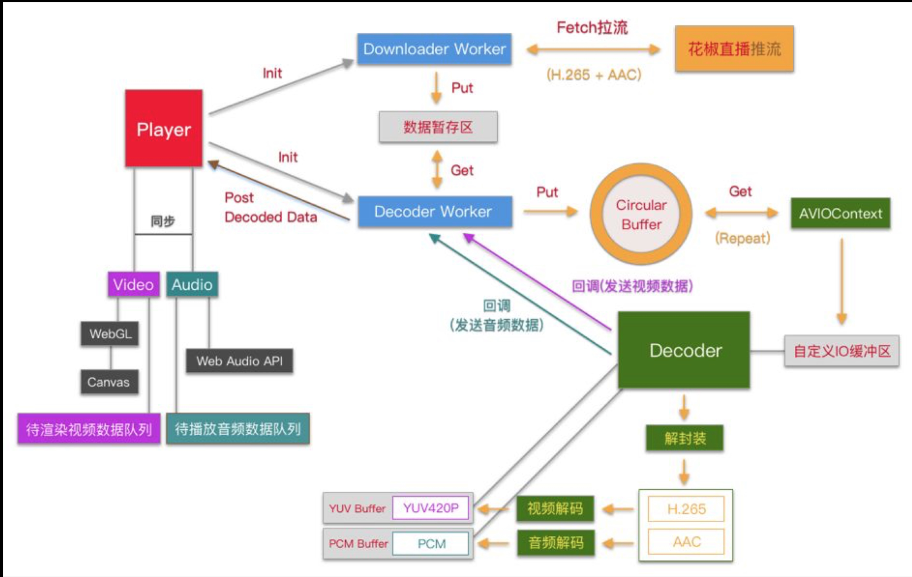

# webAssemblyPlayer

- 基本架构案例——[基于 WebAssembly 的 H.265 播放器研发](https://mp.weixin.qq.com/s/zer9k1up8d4lHvMGtU78UA)

---

## 项目整体架构图

## 项目开发步骤

> - 视频流来源(编码流需要是 h265) [视频来源](https://gw.alicdn.com/bao/uploaded/LB1l2iXISzqK1RjSZFjXXblCFXa.mp4)
> - 线上服务/本地视频流服务
> - 本地解决方案
